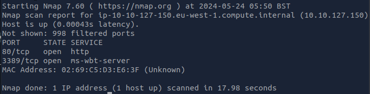
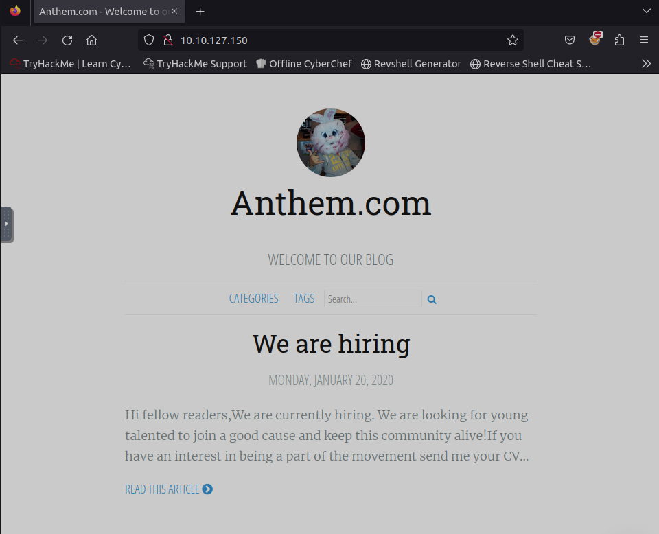
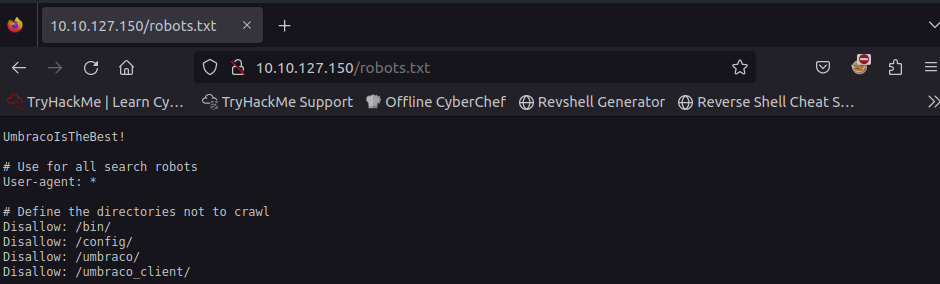
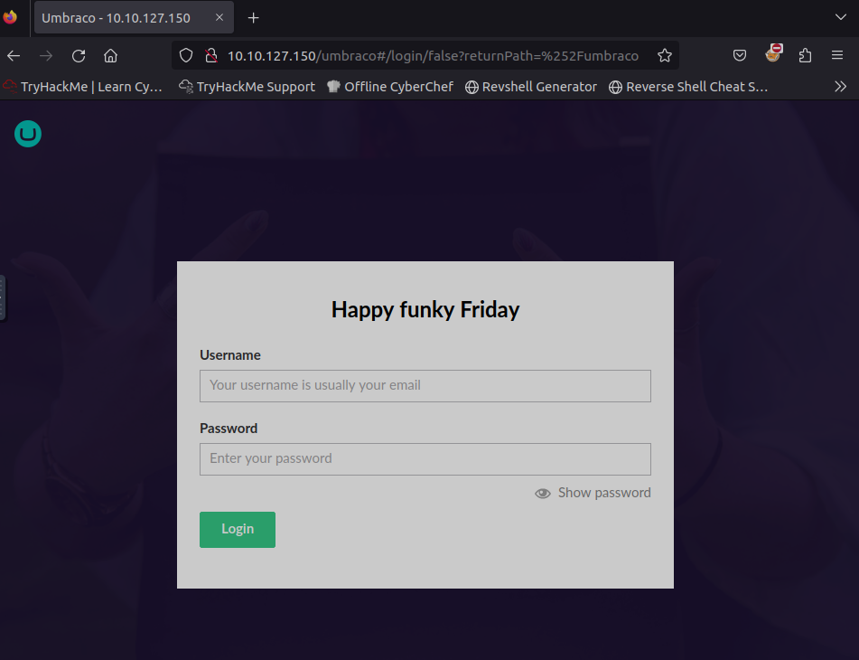
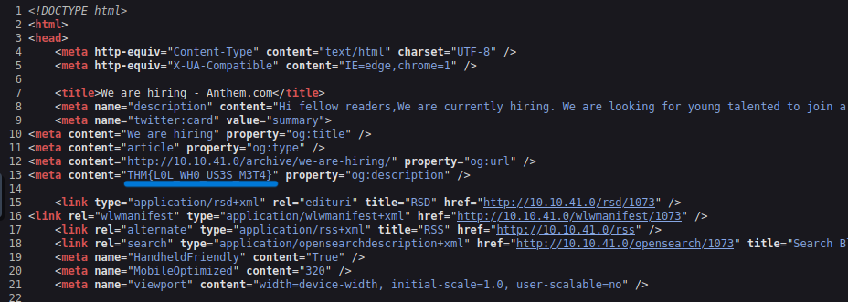
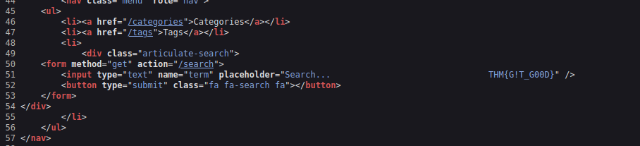
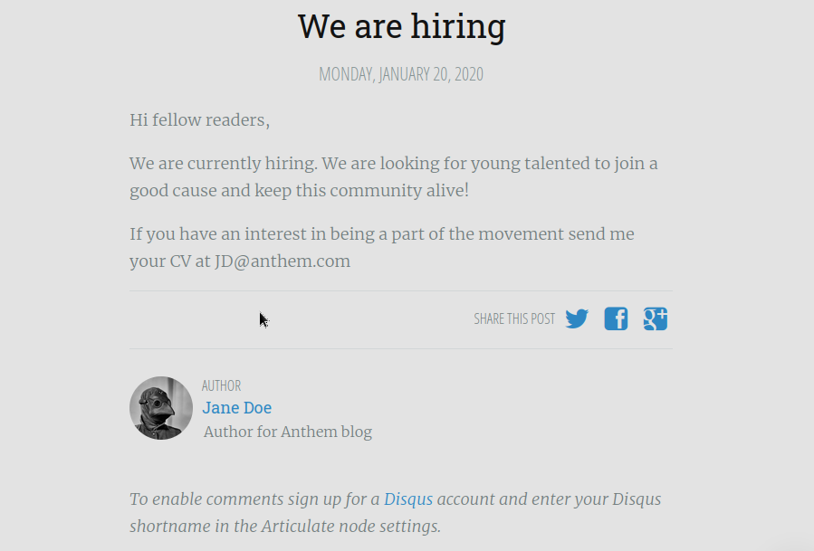
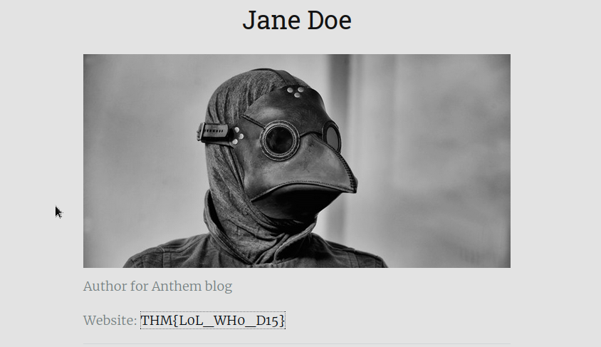
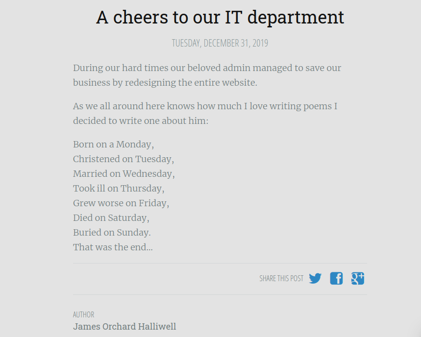

# Anthem
Exploit a Windows machine in this beginner level challenge.

## Steps
1. First and foremost, we need to spin up the target machine. Do take note of the IP address as that'll be useful.
2. The very first thing we should do, as it states on THM's website, to run nmap and see what ports are open. The command would be `nmap (IP address)`. Give it a few seconds and you'll see something like below:

  

3. As we can see, we have two ports open. Now, using what we see, we need to answer the following question: "What port is for the web server?". This would be port 80, as that's the HTTP service.
4. Next question: "What port is for remote desktop service?" This would be port 3389, as that's the RDP port.
5. When we access the site, it'll look something like this:

  

6. We've gotten another answer for the question asking about the website's domain, which is Anthem.com. Now, we can immediately check if the default file, `robots.txt`, exists on the webserver, by inserting `robots.txt` at the end of the link, which gives us this:

7. We've actually just got our first password: `UmbracoIsTheBest!`. We can visit the /umbraco page, as it seems like a potential login page, even if we can't exploit it just yet. Before doing that, it'd be wise to put the password for the following question: "What is a possible password in one of the pages web crawlers check for?" Another question which we've already gotten the answer for is: "What CMS is the website using?" The CMS being used here is Umbraco, as seen on the third screenshot. Going back to the login page, when we visit it, it'll give us this:

8. Before anything else, we need to check the page source, just in case if there's any information we can use on there. Opening it up and scrolling down just a bit, we find two flags. Flag 1: THM{L0L_WH0_US3S_M3T4} and flag 2: THM{G!T_G00D}:

9. Going back to the homepage and clicking on the first article, which is called, "We are hiring," we can see two important points-of-interest. One is the email (JD@anthem.com) and the other is the actual author of the article: Jane Doe. Let's check the page source to see 

10. When we try clicking on Jane Doe, we get another flag (flag 3: THM{L0L_WH0_D15}):

11. Going back to the homepage and clicking on the second article, which is, "A cheers to our IT department," appears to be a poem. The author for this article is James Orchard Halliwell.

12. This portion is quite clever. Since it seems like they've dedicated this poem to the admin, the admin's name could be the actual author who wrote this poem. A simple google search tells us that the poem is written by Solomon Grundy 
